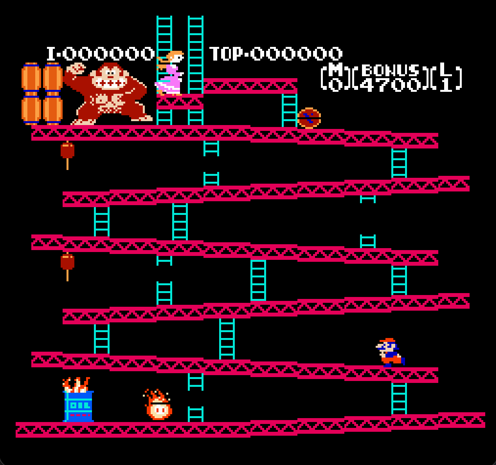

# NES Emulator

## Usage

* Clone the repo
* Open the root directory of the project in your terminal
* Run `go build ./cmd/emulator` to build the project
* Run the emulator with `./emulator <rom_file>` where `<rom_file>` is the path to
the ROM file relative to the location of the `emulator` binary

## Controls
* W, A, S, D = up, left, down, right
* G = select
* H = start
* K = B
* L = A

## List of tested games

These games are known to work with this emulator. NES cartridges use a "mapper" for bank-switching, adding more ROM or RAM, etc. Currently, only mapper 000 is implemented and only ROMs using mapper 000 will work. If a ROM is loaded that uses a mapper other than mapper 000, an error will be thrown. There are many more supported ROMs not listed below, these are just ROMs I have personally tested.

* Donkey Kong
* Balloon Fight
* Super Mario Bros
* Ice Climber

## Screenshots

### Donkey Kong

### Balloon Fight

### Super Mario Bros

### Ice Climber

